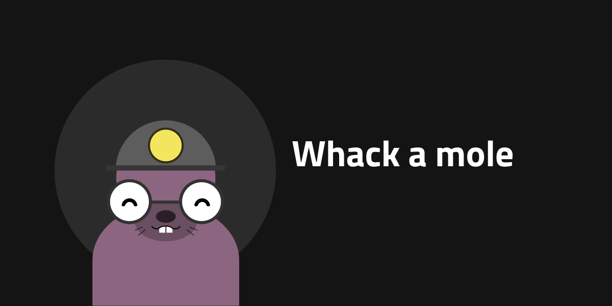

# Whack A Mole
I denna övning hittar du i mappen *example* det klassiska spelet Whack-A-Mole. Koden är dock ganska ostrukturerad med stora funktioner, nästan bara globala variabler m.m. Du har fått i uppdrag att förbättra koden utifrån ett Clean Code - perspektiv med bl.a. mer lokala variabler och koden uppdelad i flera funktioner.

Clean Code dokumentation: https://github.com/ryanmcdermott/clean-code-javascript

## Level up

När du är klar med refaktoreringen så önskar man lite fler features.

1. En high score lista! Där användaren får skriva in sitt namn och se hur denna placerade sig i listan. Mest "whacked" moles vinner.

2. Möjlighet att starta om spelet efter att tiden gått ut (`window.location.reload()* får ej användas!).

3. Möjlighet att ställa in tiden för hur långt man har på sig att spela spelet.
